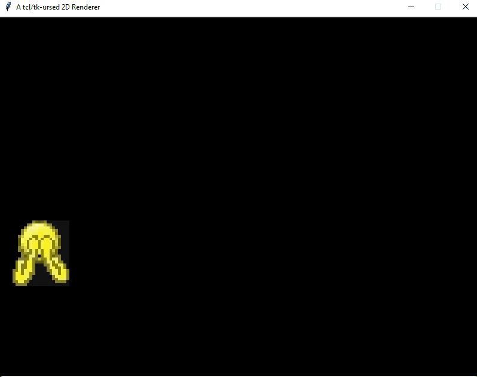

# Tkursed

A completely cursed 2D renderer done entirely with the Tcl/Tk image object.

I wanted the experience of optimizing a CPU-bound software renderer on a system
that wasn't meant for it at all - just like our DOS granddevs once did.

## Running the Examples

1. Have a Python interpreter installed that supports at least Python 3.10,
    e.g. [CPython](https://www.python.org/downloads/).
2. Install [Poetry](https://github.com/python-poetry/poetry)
3. Clone and cd to checkout directory.
    1. `git clone https://github.com/tonymke/tkursed.git`
    2. `cd tkursed`
4. Install runtime dependencies via Poetry: `poetry install --no-dev`
5. Run any of the examples in poetry's virtual environment.
    1. **POSIX**: `poetry run python examples/sprite_rendering.py`
    2. **Windows**: `poetry run python examples\sprite_rendering.py`

## Progress

- [x] Rudimentary framework and loop
- [x] Drawing frame buffer
- [x] Drawing Sprites

## License

[MIT](LICENSE.txt)
